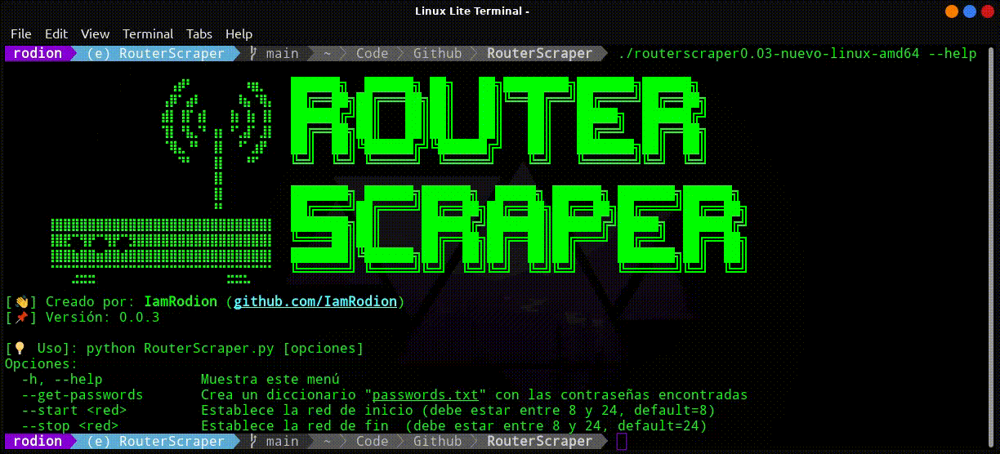

# RouterScrapper
Programa que realiza scrap con la librería request y bs4 sobre la web de configuración de routers, y obtiene mac, nombre de red y contraseña y los almacena en una base de datos SQLite3 para su gestión.
</br>



## ¿Como Instalar/Ejecutar?
Existen dos formas principales de ejecutar el código.

* Opción 1: Descargar código fuente, instalar las dependencias y ejecutarlo.
```
git clone https://github.com/IamRodion/RouterScraper.git
```
```
cd RouterScraper/
```
```
pip install -r requirements.txt
```
```
python3 RouterScraper.py
```

</br>

* Opción 2: Descargar el [último binario disponible](https://github.com/IamRodion/RouterScraper/releases/latest), añadir permisos de ejecución y ejecutarlo.

```
chmod 744 routerscraper-linux-amd64
```
```
./routerscraper-linux-amd64
```
> NOTA: Se debe tener en cuenta que este compilado funciona para equipos Linux con una versión de ldd igual o superior a 2.31. Esto se puede comprobar ejecutando en la terminal: ```ldd --version```

Una vez ejecutado el script, se debe ver algo como esto:

